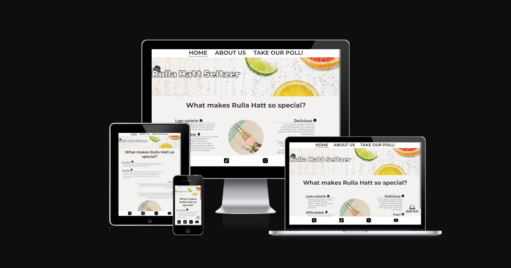
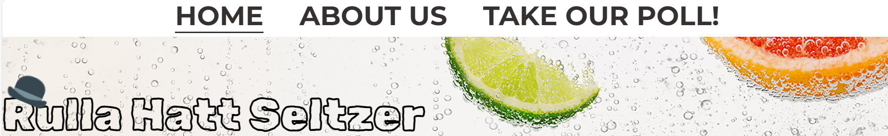
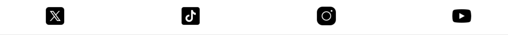
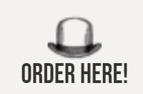
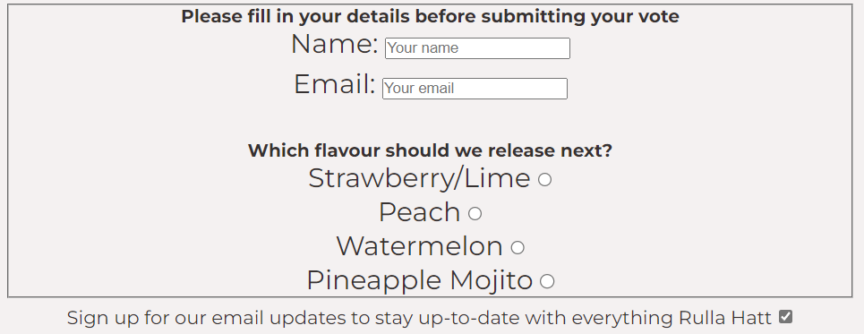
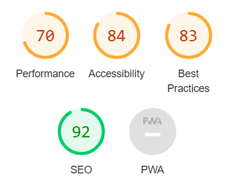

# Rulla Hatt Seltzer - Project Portfolio 1 - HTML & CSS

This website is dedicated to the new alcoholic beverage company specializing in low-calorie refreshing seltzers: Rulla Hatt!

The purpose of this website is to give some insight into the company itself, as well as to entice future customers to purchase our seltzers.

Link to live site here: <a href="https://eddwer.github.io/rhs/">Rulla Hatt Seltzer</a>

## Target Audience

The target audience for this website is potential customers of Rulla Hatt, as well as current customers looking to experience even more of the company.

## Features

#### Navbar
The navbar is featured on all 3 pages to make the user be able to seamlessly switch between them. Header image is present on all 3 as well with a clickable logo which takes the user to the main page.

### Links to social media pages

Since Rulla Hatt has a large social media presence, we find it's important to have these links always present on the page, hence we made the footer sticky on all pages.

### Link to order from Systembolaget

To make it easier for customers to find our seltzers and order them, we made a link with our logo which we keep to the bottom-right of the screen, just above the footer. We also made this sticky and put it on all 3 pages.

### Poll

To create some user interaction and as a way for our customers to feel they can have an impact, we created a poll where the users can vote for what flavour we should release next.

## Future features

1. Links to different app stores where users can download our apps
2. Create a webshop where users can purchase merch.
3. Create a "Gallery" section where we can upload user photos.

## Manual Testing

<strong>Features Testing</strong>

| Feature | Action | Effect |
| ------------- | ------------- | ------------ |
| Logo | Click | Opens Home page |
| Navbar Links | Click on Home | Opens Home page |
|  | Click on About Us | Opens About Us page |
|  | Click on Take Our Poll | Opens Take Our Poll page |
| Social Media Links | Click on X icon | Opens X homepage in new tab |
|  | Click on TikTok icon | Opens TikTok homepage in new tab |
|  | Click on Instagram icon | Opens Instagram homepage in new tab |
|  | Click on Youtube icon | Opens Youtube homepage in new tab |
| Systembolaget Link | Click on Order Here/Hat icon | Opens Systembolaget homepage in new tab |
| Submit Poll | Fill information and click on Submit | Opens Code Institute Formdump page in new tab |

<strong>Lighthouse</strong>

<b>Test Scores:</b>

* Performance: 70
* Accessibility: 84
* Best Practices: 83
* SEO: 92

Results: Overall the scores are pretty good. SEO at 92 is great. The rest of the points, especially performance, has some room for improvement in the future.

<strong>Browsers</strong>

<b>Supported Browsers and Devices</b>

* Google Chrome
* Mozilla Firefox
* Microsoft Edge
* Safari (Iphone)

<b>Responsiveness testing</b> Manual testing has been conducted on all the above browsers.

<b>Screen Sizes testing</b>

| Device/Screen Size  | Performance |
| ------------- | ------------- |
| Desktop (1920x1080) | No issues |
| Laptop (1366x768) | No issues |
| Tablet (iPad) | No issues |
| Mobile (iPhone X) | No issues |

<strong>Known Issues</strong>

* None!

## Bugs

Bug #1: IDs #footer-icon and #footer-icon-text were previously in the same class named .footer-icon, which made me unable to properly align them to eachother in the bottom right corner of the screen. I fixed this by giving them separate IDs instead!

Bug #2: Issues with scaling the #logo and #hat IDs, causing them to be very large on mobile screens. Fixed by changing from % to vw.

Bug #3: Hat icon and text in lower right of screen was not aligning correctly with eachother. Corrected this by making them list items instead.

## Credits

Image used for favicon: https://pixabay.com/vectors/bowler-hat-vintage-retro-man-954627/

Image used in header: https://www.brewingwithbriess.com/wp-content/uploads/2020/03/Seltzer_Header-Photo_Cleaned.jpg

Hat in logo found here: https://icons8.com/icons/set/hat

All social media links from: https://icons8.com/

Submit button styling partially copied from: https://www.w3schools.com/howto/howto_css_stacked_form.asp

"Reasons" part of index.html partially copied from Love Running project.

<b>No copyright fringement intended. This content is meant for educational purposes only.</b>